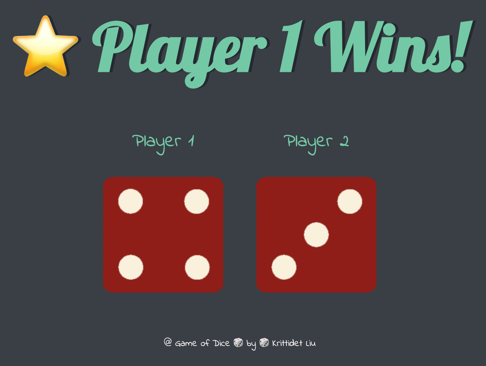

# Dice-Game
 
Small front-end web development project from Udemy course (2022 Web Development Bootcamp by Dr. Angela Yu).

This client side web application project aimed at applying HTML, CSS, JavaScript, and DOM knowledge in creating dice game. Player 1 and Player 2 each picks a dice and just refresh webpage to see who wins the dice game. 

**Sample**

 

